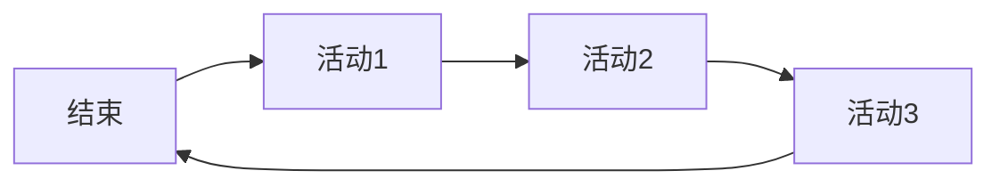

# 标题

## 子标题

* 无序列表1

  1. 有序子列表1

  代码块
  ```python
  print("Hello, world!")
  ```
*斜体*
**粗体**
***斜体加粗***
~~删除线~~

表格：

| 表头1 | 表头2 | 表头3 |
| ----- | ----- | ----- |
| 单元格 | 单元格 | 单元格 |    


图片：


链接：

[百度](https://www.baidu.com)

> 引用



```sequence
  

数学公式：$\pi$
文本显示：&pi