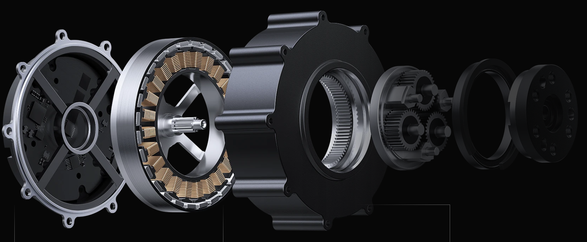

# 2.1 关节电机硬件概述
关节电机属于永磁同步电机，可以作为力矩源为四足机器人控制系统输入准确的力矩。永磁同步电机的定子和转子通过电磁场产生相互作用，使得电机的转速和转动方向与电磁场的变化相一致。通过控制转子的转速，可以实现四足机器人在不同姿态下的动力控制。永磁同步电机的FOC(Field-Oriented Control)可以实现“像素级”的控制，拥有许多独特的优势：

1. 低转速下控制

    由于控制原理的区别，无刷电调只能控制电机工作在高转速下，低速下无法控制；而FOC控制器则完全没有这个限制，不论在什么转速下都可以实现精确控制。

2. 电机换向

    同上面的理由，由于电调无法反馈转子位置，因此很难实现电机正反转的换向（当然有感电调可以实现）；而FOC驱动器的换向性能极其优秀，最高转速下正反转切换可以非常顺畅；此外FOC还可以以能量回收的形式进行刹车控制。

3. 力矩控制

    普通电调都只能控制电机转速，而FOC可以进行电流（力矩）、速度、位置三个闭环控制。

4. 噪音

    FOC驱动器的噪音会比电调小很多，原因是普通电调采用方波驱动，而FOC是正弦波。

    ## 2.1.1 关节电机基本结构
    
    机器人关节电机的核心构件是电机驱动板、定子、转子和行星减速器。因为电机适合在高转速、低力矩的工况下工作，而机器人需要的是低转速、高力矩，所以电机转子需要通过一个减速箱减速后，再输出力矩。以过约束机器人采用的小米CyberGear关节电机为例，其外形与主要构件如下图所示。

      

    ## 2.2.2 单圈绝对值编码器

    单圈绝对值编码器是一种旋转位置反馈装置，它能够在360度的旋转范围内为每个角度位置分配一个唯一的编码值。这种编码器的主要特点是即使在断电的情况下，也能够记住最后的位置，因为编码是绝对且唯一的，不需要依赖于前次的测量数据。单圈绝对值编码器通常用于那些只需要测量单次旋转位置的应用中，比如旋转门的控制、旋转编码器在测量时只在一个完整的旋转周期内提供唯一的位置信息。

    单圈绝对值编码器的工作原理是通过编码器内部的码盘，码盘上有不同的刻线，每道刻线依次以2线、4线、8线、16线编排，通过光电码盘的机械位置决定编码，从而在编码器的每一个位置，通过读取每道刻线的通、暗，获得一组从2的零次方到2的n-1次方的唯一的二进制编码（格雷码）。这种编码器的优点包括高精度、高可靠性，以及在断电后能够保留位置信息。

